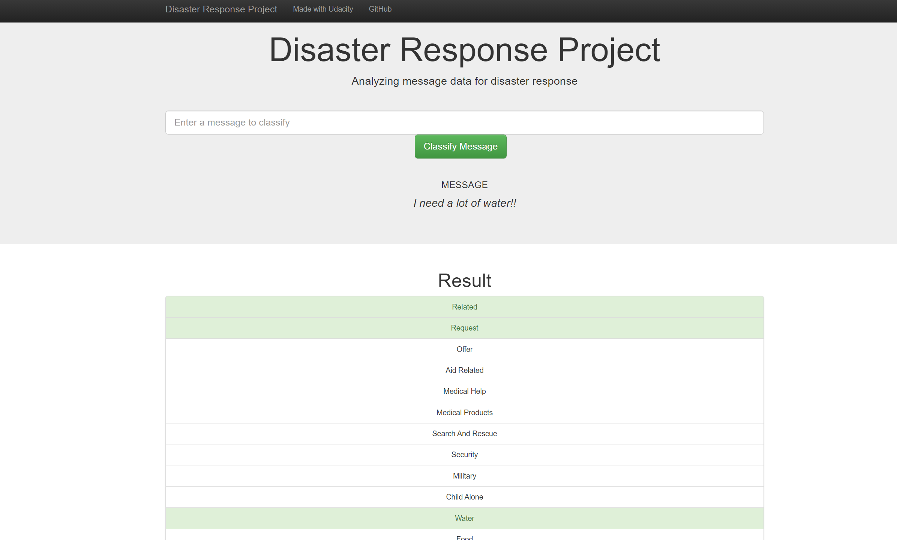

# Disaster Response Pipeline Project

### Instructions:
1. Run the following commands in the project's root directory to set up your database and model.

    - To run ETL pipeline that cleans data and stores in database
        `python data/process_data.py data/disaster_messages.csv data/disaster_categories.csv data/DisasterResponse.db`
    - To run ML pipeline that trains classifier and saves
        `python models/train_classifier.py data/DisasterResponse.db models/classifier.pkl`

2. Run the following command in the app's directory to run your web app.
    `python run.py`

3. Go to http://127.0.0.1:3001/

### Motivation
In this project, we will analyze message data provided by Figure Eight with proper labeling. Our goal is to apply nltk library from Python to classify the message to correct label. We try to capture features from NLP process using NLTK to help us refine the classification. 

### Introduction
- Firstly, we start from data processing that turn raw message and label data into one dataset for later use. 
- Secondly, we apply Machine Learning pipeline fitting using AdaBoost and RandomForest algorithm. We also output the metrics data from the process for later comparison
- Finally, we demonstrate our result using a web app built by Flask. Users can also do online classification on the webpage.

### Dataset
There are two major dataset in our project, and both of them are within data folder. Disaster_messages.csv contains the id and raw text messages and disaster_categories.csv contains labels according to message ID.

### Libraries Used
- nltk
- pandas
- plotly
- sci-kit learn
- sqlalchemy
- os
- flask

### Files and Folders
Notebook
- ETL pipeline preparation
- ML pipeline preparation
- Graph Notebook
<pre>
App Folder  
|--templates folder  
|   |-go.html: HTML that handles online classification results  
|   |-master.html: HTML for main web page  
|-run.py: Main script for flask web app  
</pre>
Data Folder  
|-disaster_categories.csv: Classification label of messages  
|-disaster_messages.csv: Dataset of messages  
|-DisasterResponse.db: SQLite database file  
|-process_data.py: Script for handling data processing  

Models Folder  
|-classifier.pkl: Pickel file of trained model   
|-Metrics.csv: Dataset storing metric result of ML pipeline fitting  
|-train_classifier.py: Script for running ML pipeline  

### Summary
- We are now able to show visualization of our dataset and metrics of our ML pipeline on our main page just like image below

- We can also perform online classification if you type text messages into the box. The result will be shown as below

- Our algorithms can achieve high accuracy over 90%, but this is trivial in this case. Because there are mostly zeroes in our label matrix, we achieve high accuracy simply by guessing all labels 0. Instead, we use f1 score to evaluate our model, which is more meaningful in this application.

- As mentioned in last paragraph, this is a very imbalanced dataset, meaning that there are a lot of zeros in our label. For some categories, you can observe that they contained mostly 0. This makes classification hard (or impossible) to function normally. Also, it makes evaluation even more difficult because you may encounter divide by 0 situation when calculating f1 score. You can see the influence by checking out last plot in our main page(capture below). Those blank point represent NAN value cause by divide by zero situation and some categories with low f1 score are caused by sparse label vector.

### Acknowledgement
Special thanks to figure eight for providing the dataset and Udacity for providing information and concept to accomplish the project.
